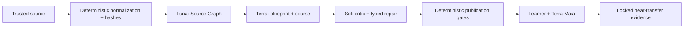

# Museion

**An interactive learning platform with deterministic ground truth and a leak-gated Socratic AI tutor.**

Museion (the Mouseion of Alexandria, "seat of the Muses") pairs a millennia-old idea — the great house of knowledge — with a personal guide inside it: **Maia**, named after maieutics, the Socratic art of helping ideas be born rather than handing them over.

> The deterministic engine owns truth. The LLM owns pedagogy. Neither can do the other's job.

Built with Next.js (App Router), React, Tailwind, the official Codex runtime, and an optional explicitly configured OpenAI Responses API provider.

The local Build Week release also includes a complete responsive presentation layer: an asymmetric source-to-evidence homepage, active accessible navigation, creator provenance review, a polished judge journey, legal disclosures for the current in-memory build, and generated social-preview metadata.

## Why

Generic LLM chatbots harm learning not by being wrong, but by being right **too early**: they hand over answers and skip the cognitive work that produces learning. A field experiment with ~1,000 high-school students (Bastani et al., *PNAS* 2025) found that unrestricted GPT access boosted in-session performance by 48% — and **lowered** unassisted exam scores by 17%. The "crutch effect" is real. A guardrailed tutor that gives hints instead of answers eliminated that harm.

Museion is built around that finding, plus the rest of the learning-science stack:

| Design principle | Evidence |
|---|---|
| Tutor must not reveal answers; it scaffolds reasoning | Bastani et al. 2025 (crutch effect); Kestin et al. 2025 (well-designed AI tutor ≈ 2× learning gains vs. active classroom) |
| Step-based tutoring, not answer-based | VanLehn 2011: step-granularity ITS reach *d* = 0.76, close to human tutors (*d* = 0.79); answer-based systems lag far behind |
| Help must fade as mastery grows | Scaffolding & fading (Wood, Bruner & Ross 1976); expertise reversal effect (Kalyuga & Sweller): guidance that helps novices hurts experts |
| Some help is necessary — pure discovery fails | Kirschner, Sweller & Clark 2006; the "assistance dilemma" (Koedinger & Aleven 2007): the question is *how much help, when* |
| Measure learning, not performance | Soderstrom & Bjork: in-session success with help is performance; what counts is delayed, unassisted transfer |

## Architecture



```
┌────────────────────────────────────────────────────────────┐
│  Browser (lesson player + Maia panel)                      │
│  Sees prompts and options only — answers, solutions and    │
│  hints NEVER leave the server.                             │
└──────────────────────────▲─────────────────────────────────┘
                           │ Next.js API routes
┌──────────────────────────┴─────────────────────────────────┐
│  Maia (LLM layer, server-only)        src/lib/maia         │
│  Socratic coaching only. Receives: verified solution,      │
│  learner attempts, detected misconception, allowed help    │
│  level. Hard-forbidden from stating the final answer.      │
│  Buffers strict typed replies; validates before delivery.  │
└──────────────────────────▲─────────────────────────────────┘
                           │ structured lesson-state snapshot
┌──────────────────────────┴─────────────────────────────────┐
│  Deterministic engine (truth)         src/lib/engine       │
│  • Verifier — grades answers against authored specs        │
│  • Misconception matcher — names the specific wrong path   │
│  • Mastery model — per-concept EMA, discounts assisted     │
│    success                                                 │
│  • Fading policy — hint-ladder depth shrinks with mastery  │
│  • Session state machine — step-based progress + event log │
└──────────────────────────▲─────────────────────────────────┘
                           │
┌──────────────────────────┴─────────────────────────────────┐
│  Content (authored ground truth)      src/lib/content      │
│  Lessons as type-checked TypeScript data: steps, answer    │
│  specs, worked solutions, misconception libraries, hint    │
│  ladders                                                   │
└────────────────────────────────────────────────────────────┘
```

The key inversion versus a chatbot wrapper: Maia doesn't start from an empty prompt box. Every turn she sees the exact lesson state — what the step asks, the author-verified solution (marked *do not reveal*), every attempt the learner made, which misconception their last mistake matches, and how much scaffolding the fading policy currently allows. The deterministic verifier, not the model, decides correctness. Maia's structured response is checked before delivery and falls back to authored guidance when it is unsafe or unavailable.

## Getting started

Requires Node.js 20+ and the Codex CLI or the macOS ChatGPT app for local live AI. Codex uses its official authentication flow; Museion never accepts a ChatGPT token or API key in the browser.

```bash
npm install

# Keyless replay and deterministic tutoring work immediately.
cp .env.example .env.local

# Optional local ChatGPT/Codex mode (uses plan quota, not API billing):
# MUSEION_LOCAL_AI=1

npm run dev                  # http://localhost:3000
```

Open `/settings` to inspect the runtime, connect through the official Codex device flow, choose live or offline mode, and check the available GPT-5.6 variants. Local mode is disabled on hosted deployments. ChatGPT and API billing remain separate: Museion never switches to paid API usage automatically.

The balanced Build Week policy routes Source Graph extraction to `gpt-5.6-luna`, learning design/course generation and Maia to `gpt-5.6-terra`, and critic/typed repair to `gpt-5.6-sol`. Requested and resolved models are recorded. Luna may visibly fall forward within the GPT-5.6 family; Sol remains mandatory for publication validation.

The Build Week source path starts at `/create`: paste text/Markdown or choose a selectable-text PDF, then inspect normalized pages, warnings, and SHA-256 hashes. The checked six-page binary-search source resolves to `/create/review`, where concepts, claims, exact quotations, blueprint objectives, block citations, hashes, and blocking validators are inspectable. `/judge` then runs the complete keyless replay: five artifact-driven blocks, one locked near-transfer attempt, and a reconciled evidence ledger. Arbitrary sources remain normalized but are not falsely presented as compiled until a live provider has produced and passed every validator.

```bash
npm test        # 155 offline tests; 17 explicit live cases skip without opt-in
npm run build   # production build
# With `npm run dev` running in another terminal:
npm run verify:ui  # Chrome: legacy path + full judge path 20× desktop and once at 320 px
```

## Project layout

```
src/
├── app/                  # Catalog, creator review, judge, lesson, practice, about
│   └── api/              # owner-bound authored and judge-session routes
├── components/           # Players, Maia, creator, typed interactive blocks
└── lib/
    ├── api-types.ts      # Wire contracts shared by routes and components
    ├── client/           # Browser-only helpers (storage keys, onboarding flag)
    ├── content/          # Ground truth: types, validation, lessons as checked TS data
    ├── ai/               # server-owned routing, Codex runtime, settings and guards
    ├── compiler/         # Source Graph, templates, jobs, private/public Artifact v2
    ├── evidence/         # locked transfer events and bounded observations
    ├── engine/           # Deterministic core: verifier, mastery, session, practice
    ├── judge/            # keyless replay session and public response boundary
    ├── maia/             # GPT-5.6 provider, strict turns, leak-gated tutor
    ├── runtime/          # pure block reducers, validators, replay, tutor snapshots
    ├── source/           # Text/PDF normalization, hashes, spans, hard limits
    ├── server/           # owner resolution, rate limits, memory/Supabase state boundary
    └── store.ts          # authored lesson/profile store (durable migration remains)
supabase/migrations/      # server-owned expiring state table, RLS, explicit grants
tests/                    # Vitest suite: engine, content validation, prompt, sanitization
```

## Design notes

- **The browser does not receive hidden truth before it is earned.** Lesson pages ship a sanitized lesson (prompts and options only). Verification, hints, misconceptions, and solutions live server-side; a solved step may then reveal its authored explanation.
- **Hint ladder with contingent fading.** Each step ships an authored ladder (orienting question → conceptual hint → procedural hint). The depth a learner may descend is capped by their mastery of the step's concept: novices get the full ladder, proficient learners get one Socratic nudge. Maia's tone follows the same signal.
- **Misconception library.** Wrong answers are matched deterministically against known wrong paths (e.g. answering `2` to "what do we subtract from both sides of 2x + 6 = 14?" means the learner confused coefficient with constant). Maia is told *which* confusion to address, not left to guess.
- **Mastery discounts assisted success.** Solving on a later attempt or after hints moves mastery half as much as clean first-attempt success — performance with a crutch is weak evidence of learning.
- **Event log first.** Every answer, hint, and tutor turn is recorded, because the metric that validates Museion is delayed, unassisted transfer — not how many problems were solved with Maia present.
- **Pre-delivery tutor gate.** Maia uses GPT-5.6 Terra through local Codex, or an explicitly selected future API provider, with a strict Zod output contract. The whole turn is buffered, its UI targets and answer leakage are checked, and one unsafe repair is allowed before deterministic fallback.
- **Canonical source boundary.** Text, Markdown, and selectable-text PDF are normalized in the browser into versioned pages with stable SHA-256 hashes. Source-derived spans use exact unique quotes and explicit UTF-16 offsets; instruction-looking prose is preserved as data and flagged for review.
- **Provider-neutral compiler.** Source Graph, Blueprint, Artifact, critic, and one typed repair run as a resumable owner-bound job with hashes, timeouts, cancellation, stage/model progress, duplicate protection, and fail-closed validators. GPT-5.6 uses strict Structured Outputs; the checked replay uses the same contracts without credentials.
- **Data-only interactive runtime.** PredictionChoice, RangeExplorer, StateTrace, and SequenceBuilder are closed block kinds backed by pure server-side reducers. The public artifact contains prompts and initial state, never correct orders, expected traces, answer specs, or misconception rules.
- **Locked evidence, narrowly worded.** Transfer is artifact-version-bound, permits one attempt, exposes no Maia/hints/solutions, hashes the raw response rather than storing it, and reports one immediate near-transfer observation plus its limitations—not mastery.
- **Explicit persistence mode.** Keyless development uses a bounded in-process backend. A deployment can opt compiler and Judge state into Supabase with server-only credentials; partial configuration fails closed, while authored lesson/profile persistence remains on the roadmap.
- **Practice has no deterministic hint ladder.** Each exercise bank is shuffled and stripped of hints on the server. Maia remains available, so practice performance is not presented as independent-transfer evidence.
- **The name is the thesis.** `/about` tells the story: the Mouseion of Alexandria as the house of knowledge, and Maia — from maieutics, Socrates' midwifery of ideas — as the guide who asks instead of telling. First-time visitors get a short onboarding tour that sets the same expectation: she will never give you the answer.

## Roadmap

See [`TODO.md`](TODO.md) — highlights: persistence and accounts, interactive lesson widgets (the drag-the-tangent moat), retention probes for measuring delayed transfer, Maia red-teaming, voice.

## License

[MIT](LICENSE)
