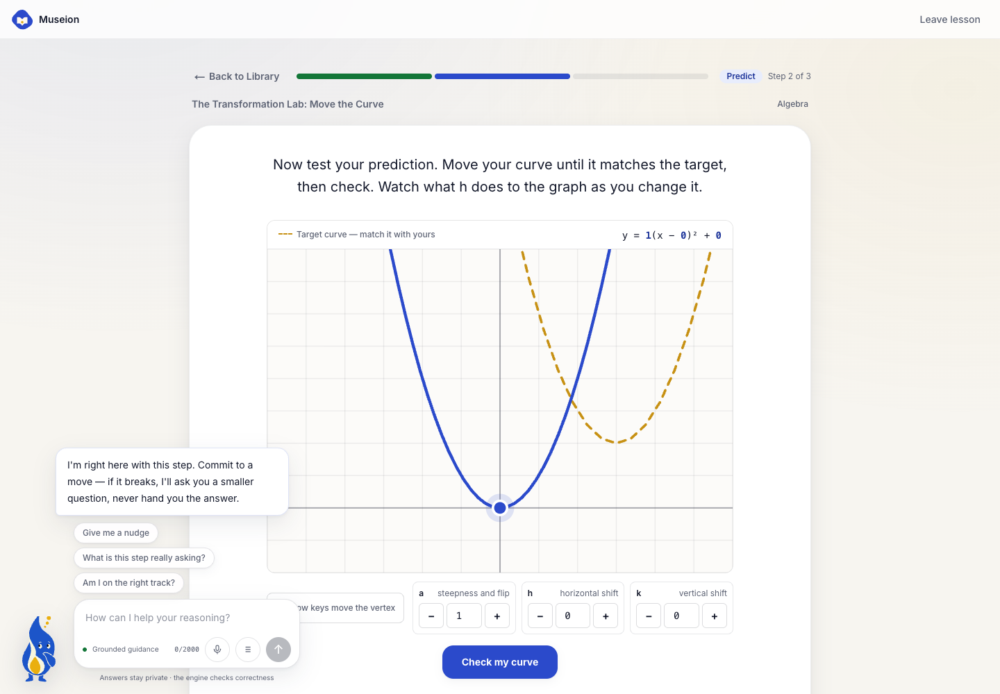
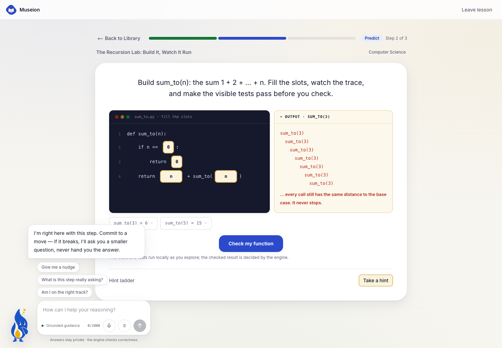
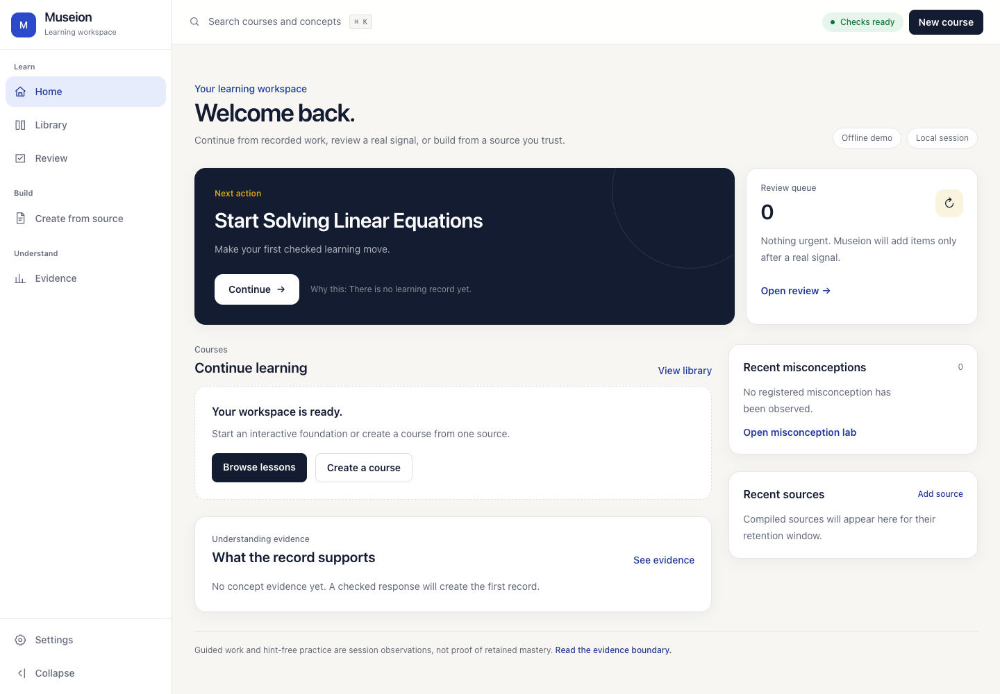
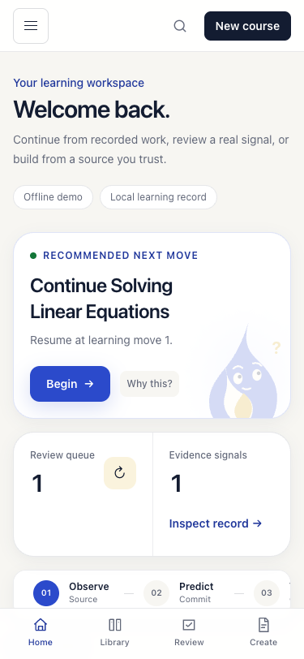
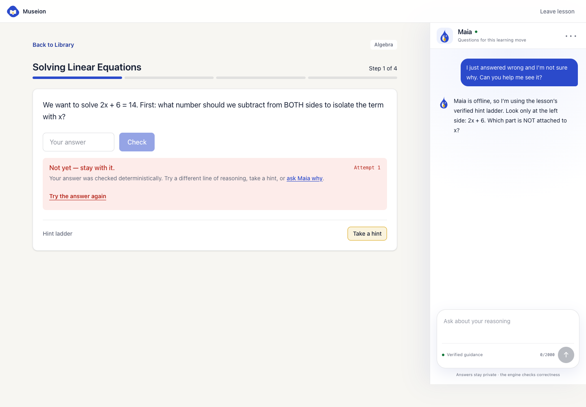
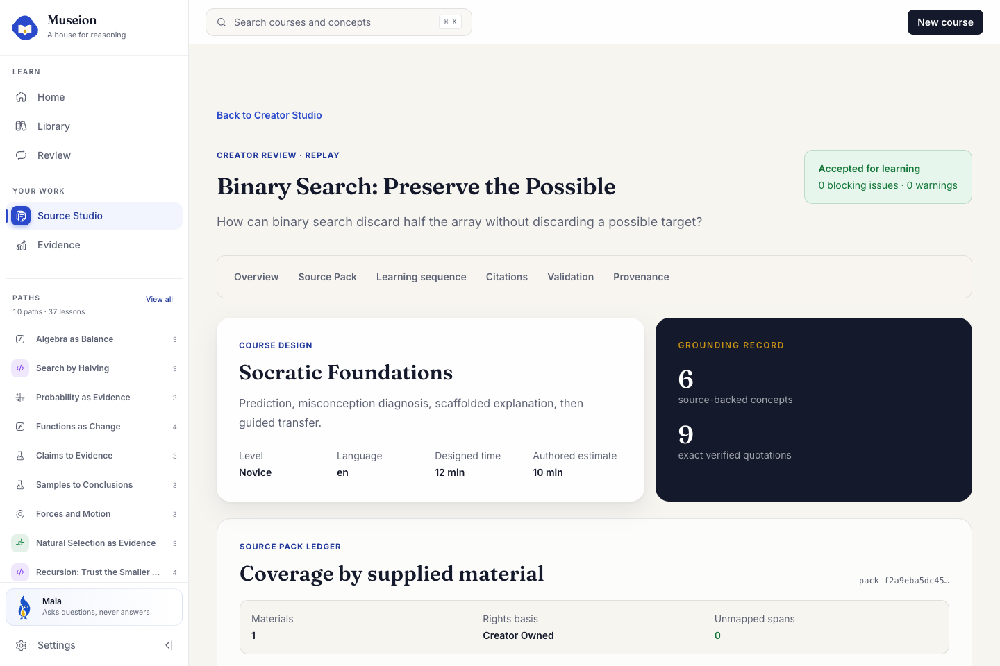
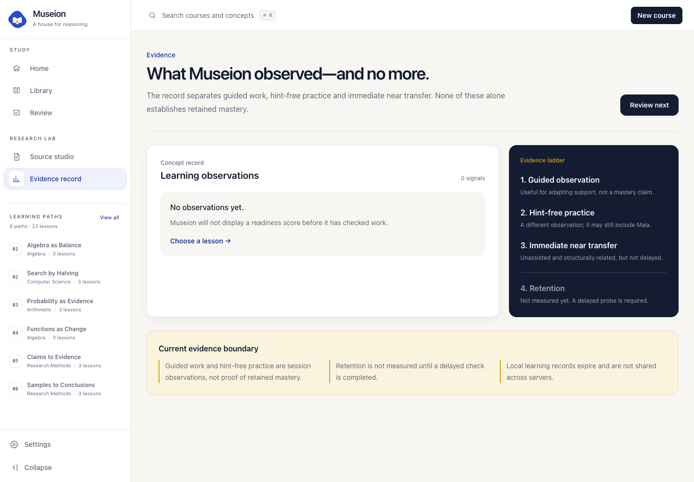
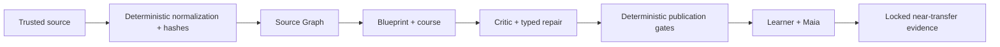

<p align="center">
  
</p>

<h1 align="center">Museion</h1>

<p align="center"><strong>AI can solve the problem. Museion helps you learn to solve it.</strong></p>

<p align="center">
  <a href="#try-it-in-two-minutes">Try it in 2 minutes</a> ·
  <a href="#the-museion-method">The Museion Method</a> ·
  <a href="#architecture">Architecture</a> ·
  <a href="#how-codex-and-gpt-56-built-this">Codex & GPT-5.6</a> ·
  <a href="#honest-limitations">Honest limitations</a>
</p>

---

In a randomized field experiment with nearly 1,000 high-school mathematics students, unrestricted GPT access improved practice performance — and *lowered* subsequent unassisted exam performance. A guardrailed tutor kept most of the benefit without the damage (Bastani et al. 2025). Tutoring is one of the best-evidenced interventions in education; the open question is what kind of tutor an AI should be.

Museion is our answer: a learning environment where **the deterministic engine owns truth**, **the source keeps the course grounded**, and **Maia** — a Socratic tutor who is architecturally unable to give the answer — **guides the reasoning until you don't need her**. As models keep getting smarter, the point of a tool like this is not to compete with them — it is to make sure humans keep compounding too.


## Try it in two minutes

**No account, no API key, nothing to configure.**

**[Open the live judge experience →](https://museion-beta.vercel.app/judge)**

The hosted path runs the complete verified replay immediately. To run the same path from source:

```bash
npm ci && cp .env.example .env.local && npm run dev
```

Then open **http://localhost:3000/judge** — the complete sample lesson: source evidence, a required prediction, deterministic checking, bounded Maia guidance, and a locked independent transfer check at the end. Everything a judge needs to evaluate runs keyless.

## The Museion Method

Seven moves, visible inside the product — on the landing page, on the dashboard strip (driven by your real next action), and as live phase chips inside every lesson:

**Ground → Predict → Interact → Diagnose → Explain → Transfer → Revisit**

1. **Ground** — every claim starts from source material you can inspect: exact spans, pages, SHA-256 hashes.
2. **Predict** — you commit to an answer before any explanation appears.
3. **Interact** — you manipulate the idea: shape a curve, narrow a range, order steps, trace state.
4. **Diagnose** — deterministic code checks the move and matches it against a library of known wrong paths. Keep missing and the step deals fresh numbers: an authored variation with its own verified answer and misconception triggers, so the retry re-exercises the reasoning instead of recall.
5. **Explain** — you put the *why* into your own words; Maia probes the explanation, not the answer.
6. **Transfer** — one nearby problem, completely unassisted. Maia leaves the room; exactly one scored attempt.
7. **Revisit** — verified concepts return on an expanding schedule (1 → 3 → 7 → 14 → 30 days), computed from recorded timestamps. Only unassisted correct answers climb the ladder, cramming refreshes the clock without climbing, and a miss resets it.

## Two labs — Interact, for real

**The Transformation Lab.** Learners shape **y = a(x − h)² + k** with drag, keyboard, or numeric controls until their curve matches a target. The engine — not the model — detects the classic wrong paths (shifting left when the form says right, swapping h and k, changing steepness instead of position) and tells Maia *which* confusion to address:



**The Recursion Lab.** Learners complete recursive functions slot by slot — never free code — and watch the call trace respond live. Choose a recursive argument that makes no progress and the output panel shows the runaway calls and says exactly why they never stop; visible tests turn green as the definition comes right:



Both labs are first-class steps inside the same deterministic pipeline as everything else: authored answers, misconception triggers proven non-verifying by tests, hint ladders, leak-gated tutoring. The lab simulator only understands the enumerated option forms — no arbitrary code ever runs.

## A learning workspace, not an XP dashboard

The dashboard computes one justified next action from the real record (active transfer → unfinished course → review signal → fresh course → first lesson), shows which Method move it exercises, and refuses to invent streaks, XP, or readiness scores. Empty states stay honestly empty.



| Course library | Mobile |
|---|---|
|  |  |

## Maia lives inside the learning move

Maia is an original character — a "living idea" drawn as a single flat SVG with deterministic expression states. She sees the current activity, the last learner action, the detected misconception — and the live canvas: as you drag a curve or fill a code slot, the unchecked widget state travels with your message (validated server-side against the active step, learner's own values only), so even the offline reply can say "I can see your canvas: a=1, h=−3, k=2." When the checker registers a known wrong path, the environment marks the exact equation term or lab control that misconception is about — a gold attention mark, authored per misconception and validated to point only at what is already on screen, so it can never leak an answer — and Maia asks one smaller question. She will never state the answer, fill an input, overrule the checker, or stay in the room during transfer.

Every learner-visible model reply is **leak-gated before delivery**: schema-validated, UI-target-checked, and scanned for the answer in digits, fractions, spelled-out numbers across seven languages, option echoes, and vertex coordinates — with one bounded repair attempt and a deterministic fallback.



## Museion Originals

Ten authored learning paths — 37 deterministic lessons — are the product core, not the demo, spanning math, physics, biology, and computer science: **Algebra as Balance**, **Functions as Change** (including the Transformation Lab), **Proportional Reasoning**, **Search by Halving**, **Recursion: Trust the Smaller Case**, **Forces and Motion**, **Natural Selection as Evidence**, **Probability as Evidence**, **Claims to Evidence**, and **Samples to Conclusions**. Each documents audience, prerequisites, sources, a misconception map, accessibility decisions, and an explicit evidence boundary (see [`docs/course-authoring`](docs/course-authoring/README.md)).

## Create from your sources

The secondary path: bring material you're allowed to use — notes, excerpts, transcripts, PDFs, references — as one **Source Pack**. The **Course Architect** first judges whether the material can support a course at all (source substance, rights, goal specificity, misconception potential, feasible interactions, transfer, leak risk) and narrows or refuses rather than inflating thin material. A link is provenance, not content: Museion never scrapes videos, paywalled books, or private captions.

Compilation runs as staged, schema-validated, hash-chained passes with deterministic publication gates; the review screen shows concepts, exact quotations, per-material citation coverage, and every blocking validator. The same capability is exposed as a typed MCP endpoint for ChatGPT, Codex, Claude Code, and Cursor ([`docs/MCP_COURSE_ARCHITECT.md`](docs/MCP_COURSE_ARCHITECT.md)).

| Creator Studio | Source-grounded review |
|---|---|
|  |  |

## Independent evidence

The record distinguishes **observed** (what happened, help included), **inferred** (an adaptive scaffolding estimate), and **not claimed** (durable mastery, far transfer). Transfer is artifact-version-bound, allows exactly one scored attempt with zero assistance, and reports one immediate near-transfer observation plus its limitations.



## Potential impact

Museion's bet is structural, not cosmetic: any subject with checkable moves can run on the same spine — authored courses prove the ceiling, Source Packs + Course Architect generalize the floor, and the MCP endpoint lets any agent client compile grounded courses through the same gates. The near-term audience is students and self-learners who already use AI daily and are quietly losing the practice effect; the honest evidence model is designed so schools can adopt it without buying inflated claims. What scales is the *contract* — truth in code, grounding in sources, thinking left to the human — which is exactly the part that stays valuable as models get smarter.

## Architecture



```
┌────────────────────────────────────────────────────────────┐
│  Browser (lesson player + Maia panel)                      │
│  Sees prompts and options only — answers, solutions and    │
│  hints NEVER leave the server.                             │
└──────────────────────────▲─────────────────────────────────┘
                           │ Next.js API routes
┌──────────────────────────┴─────────────────────────────────┐
│  Maia (LLM layer, server-only)        src/lib/maia         │
│  Socratic coaching only. Receives: verified solution,      │
│  learner attempts, detected misconception, allowed help    │
│  level. Hard-forbidden from stating the final answer.      │
│  Buffers strict typed replies; leak-gates before delivery. │
└──────────────────────────▲─────────────────────────────────┘
                           │ structured lesson-state snapshot
┌──────────────────────────┴─────────────────────────────────┐
│  Deterministic engine (truth)         src/lib/engine       │
│  • Verifier — numeric / choice / expression / graph        │
│  • Misconception matcher — names the specific wrong path   │
│  • Mastery model — per-concept EMA, discounts assisted     │
│    success                                                 │
│  • Fading policy — hint-ladder depth shrinks with mastery  │
│  • Session state machine — step-based progress + event log │
└──────────────────────────▲─────────────────────────────────┘
                           │
┌──────────────────────────┴─────────────────────────────────┐
│  Content (authored ground truth)      src/lib/content      │
│  Lessons as type-checked TypeScript data: steps, answer    │
│  specs, worked solutions, misconception libraries, hint    │
│  ladders                                                   │
└────────────────────────────────────────────────────────────┘
```

The key inversion versus a chatbot wrapper: Maia doesn't start from an empty prompt box. Every turn she sees the exact lesson state — what the step asks, the author-verified solution (marked *do not reveal*), every attempt, which misconception the last mistake matches, and how much scaffolding the fading policy allows. The verifier, not the model, decides correctness.

## How Codex and GPT-5.6 built this

- **Codex** is both a build tool and a runtime: the project was developed with Codex-driven iterations, and the app's live mode talks to ChatGPT through the official Codex device flow (plan quota, never API keys in the browser). The Codex runtime integration lives in `src/lib/ai/codex-runtime.ts`.
- **GPT-5.6** powers the course compiler and Maia with per-stage routing: Source Graph extraction on `gpt-5.6-luna`, learning design and tutoring on `gpt-5.6-terra`, critic and typed repair on `gpt-5.6-sol`. Requested and resolved models are recorded per run; publication validation always runs. Details: [`docs/CODEX_USAGE.md`](docs/CODEX_USAGE.md).
- Every model output crosses a typed boundary (Zod Structured Outputs), and everything learner-facing passes deterministic gates the model cannot override.

## Getting started

Requires Node.js 20+. Live AI is optional — the whole judge path is keyless.

```bash
npm ci
cp .env.example .env.local
npm run dev                    # http://localhost:3000
```

Open `/settings` to inspect the runtime, connect through the official Codex device flow, choose live or offline mode, and check the available GPT-5.6 variants. Local mode is disabled on hosted deployments. ChatGPT and API billing remain separate: Museion never switches to paid API usage automatically.

The balanced Build Week policy routes Source Graph extraction to `gpt-5.6-luna`, learning design/course generation and Maia to `gpt-5.6-terra`, and critic/typed repair to `gpt-5.6-sol`. Requested and resolved models are recorded. Luna may visibly fall forward within the GPT-5.6 family; Sol remains mandatory for publication validation.

The secondary authoring path starts at `/create`: YouTube videos and playlists, books and course pages, transcripts, excerpts, notes, pasted text, and uploaded files are all material shapes inside one **Source Pack → Course Architect** capability—not separate products. A pack can hold up to eight independently editable materials, each with its own evidence role and optional provenance reference; creators can order, remove, inspect, and normalize them as one bounded course input. File drafts retain metadata but never file bytes and require reattachment after refresh. The server rechecks every document, material identity, rights declaration, and complete pack hash before compilation. The clickable Course Architect opens as a chat rail (a sheet on mobile), accepts source links, authorized material, files, and independent learner goals, then runs a visible Museion Method check before the Codex-backed compiler starts. It checks source substance, rights, normalization, goal specificity, misconception and interaction potential, transfer, accessibility, and answer-leak risk; insufficient material is narrowed or blocked instead of inflated into a meaningless course. A link is provenance, not content: Museion still requires the authorized transcript, excerpt, or notes and does not scrape videos, bypass paywalls, or pretend to compile from a URL alone. Normalized pages, warnings, source references, and SHA-256 hashes are inspectable. The checked six-page binary-search source resolves to `/create/review`, where concepts, claims, exact quotations, blueprint objectives, block citations, hashes, and blocking validators are visible. `/judge` runs the complete keyless replay. Arbitrary sources remain normalized but are not falsely presented as compiled until a live provider has produced and passed every validator.

The same Course Architect is available through a bounded Streamable HTTP MCP endpoint for compatible clients such as ChatGPT, Codex, Claude Code, and Cursor. Source Pack preparation is deterministic; model-backed compilation requires an explicit server token and still passes through the existing typed compiler, critic, repair, citation, and publication gates. Every new run persists a raw-content-free manifest bound to the compiled document hash, and Creator review shows cited spans and learning blocks per supplied material. See [`docs/MCP_COURSE_ARCHITECT.md`](docs/MCP_COURSE_ARCHITECT.md).

```bash
npm test                       # offline suite (300+ tests; live cases skip without opt-in)
npm run typecheck && npm run lint
npm run build && npm run verify:bundle
npm run verify:ui              # full browser gate: flows, axe/WCAG, keyboard, 320px, concurrency
npm run screenshots            # regenerate all 20 README/product screenshots from real routes
```

Optional local ChatGPT/Codex mode: set `MUSEION_LOCAL_AI=1`, then connect in `/settings` via the official device flow. Hosted deployments keep local AI disabled; ChatGPT plan usage and API billing are never mixed silently.

Settings also includes a short **Copy setup prompt** for Codex. It carries the canonical GitHub repository URL, clone/open instructions, the local runtime command, and the complete handoff back to `/settings`, so it can be pasted into a new Codex or coding-agent chat without prior context. The flow needs no Museion account, database, or API key: Codex starts the explicitly enabled local runtime, then the user completes the official ChatGPT device login and runs the model check.

## Feedback / Session ID

Build Week submissions record a `/feedback` Session ID on Devpost. The checklist lives in [`docs/build-week/DEVPOST_DRAFT.md`](docs/build-week/DEVPOST_DRAFT.md); the Session ID is generated at submission time from the Codex `/feedback` command and pasted into the Devpost form — it is deliberately not committed to the repository before then.

## Honest limitations

- **Retention is scheduled, not yet proven.** The spaced ladder computes when each verified concept is due for an unassisted recheck, and completing that check records a new observation — but the learning record is process-local, so long-horizon retention across devices and weeks is not yet measured.
- **Learner sessions are process-local** in keyless mode (compiler/judge state can use Supabase). A server restart clears the local learning record; the dashboard says so.
- **The research motivates the constraints; it does not prove a Museion effect.** Bastani et al.'s population and prompts are not ours. Kestin et al. 2025, VanLehn 2011, and the scaffolding/fading literature inform the design as hypotheses, not borrowed effect sizes ([`docs/RESEARCH_SOURCES.md`](docs/RESEARCH_SOURCES.md)).
- **Leak-gating reduces risk; it cannot make it zero.** The gate covers digits, fractions, spelled numbers in seven languages, option echoes, and graph parameters, with red-team tests — and we document the trade-offs in code.
- **Fading applies to authored lessons**; generated courses use bounded runtime rules, not the full mastery model.

## Project layout

```
src/
├── app/                  # Landing, dashboard, library, lessons, judge, creator, review
│   └── api/              # owner-bound authored and judge-session routes
├── components/           # Players, Maia, creator, graph lab, typed interactive blocks
└── lib/
    ├── api-types.ts      # Wire contracts shared by routes and components
    ├── content/          # Ground truth: lessons as checked TS data (incl. graph lab)
    ├── engine/           # Deterministic core: verifier, mastery, session, practice
    ├── maia/             # GPT-5.6 provider, strict turns, leak-gated tutor
    ├── compiler/         # Source Graph, templates, jobs, private/public Artifact v2
    ├── source/           # Text/PDF normalization, hashes, spans, hard limits
    ├── judge/ runtime/   # keyless replay, pure block reducers, tutor snapshots
    ├── evidence/         # locked transfer events and bounded observations
    └── server/           # owner resolution, rate limits, bounded caches, state backends
supabase/migrations/      # server-owned expiring state table, RLS, explicit grants
tests/                    # Vitest: engine, content validation, leak gate, red-team, MCP
```

## Roadmap

See [`TODO.md`](TODO.md) — highlights: durable learner accounts, Maia-free retention probes, per-client MCP identities, deployment.

## Brand

The mark combines an organic house of knowledge, an open book as a threshold, and a gold point — the idea Maia helps bring into view. Explored with OpenAI image generation, then reconstructed as flat SVG. Assets and usage: [`docs/brand`](docs/brand/README.md).

## License

[MIT](LICENSE)
