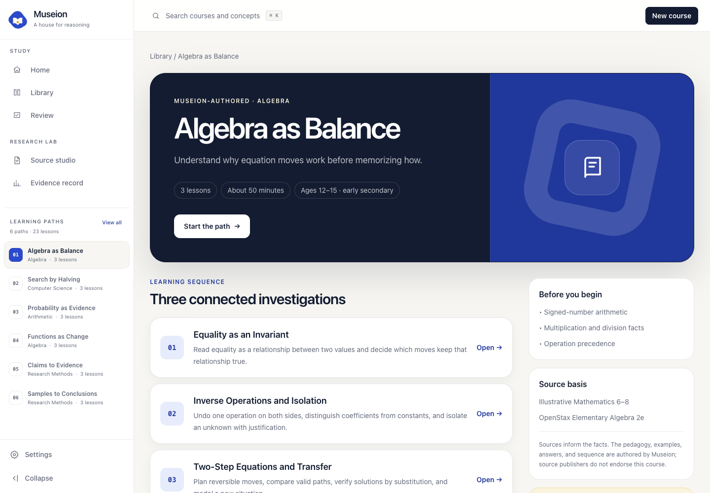
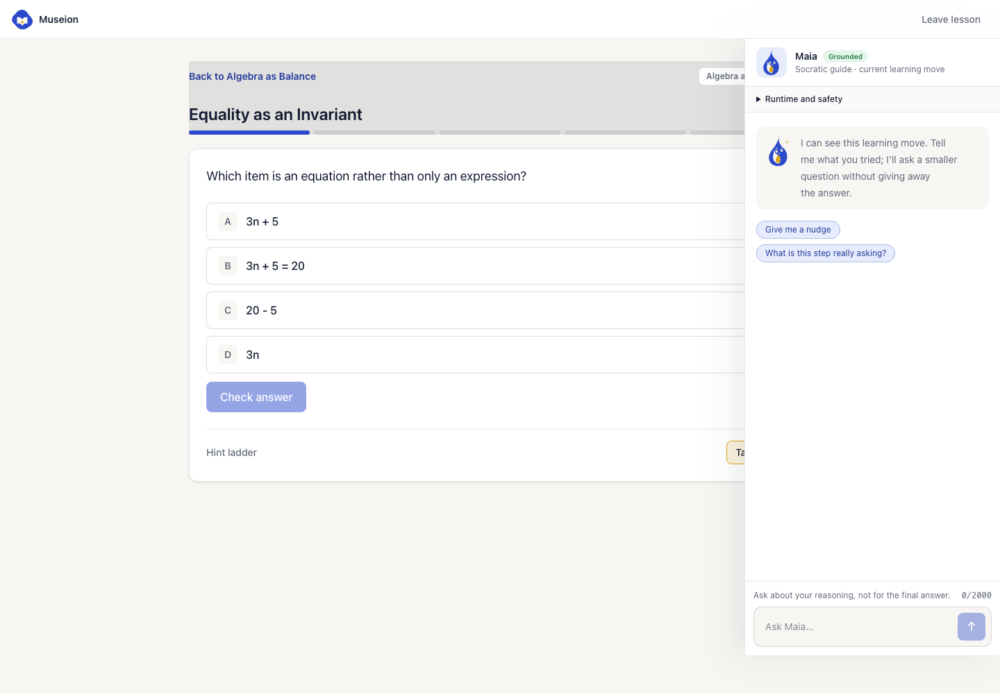
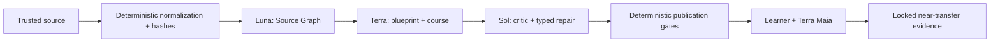

<p align="center">
  
</p>

<h1 align="center">Museion</h1>

<p align="center"><strong>An interactive learning platform with deterministic ground truth and a leak-gated Socratic AI tutor.</strong></p>

<p align="center">
  <a href="#product-tour">Product tour</a> ·
  <a href="#architecture">Architecture</a> ·
  <a href="#getting-started">Run locally</a> ·
  <a href="docs/LEARNING_SCIENCE.md">Learning science</a>
</p>

Museion (the Mouseion of Alexandria, "seat of the Muses") pairs a millennia-old idea — the great house of knowledge — with a personal guide inside it: **Maia**, named after maieutics, the Socratic art of helping ideas be born rather than handing them over.

> The deterministic engine owns truth. The model proposes pedagogy. Neither can do the other&apos;s job.

Built with Next.js (App Router), React, Tailwind, the official Codex runtime, and an optional explicitly configured OpenAI Responses API provider.

Museion is not a chat wrapper. It turns authorized source material into a bounded learning experiment:

1. normalize and hash the source without a model;
2. extract claims and exact evidence spans;
3. design predictions, explanations and practice around a course template;
4. audit grounding, answer privacy and runtime compatibility before publication;
5. tutor with Maia without revealing the answer;
6. finish with one locked, immediate near-transfer observation—and describe it no more strongly than the evidence allows.

The Build Week release includes two deep Museion-authored course paths, eleven deterministic lessons, a research-led source-to-learning homepage, responsive learning workspace, global course/lesson/concept search, deterministic review queue, creator provenance review, polished keyless replay, and explicit limitations for the current persistence model.

Its visible learning protocol is **Ground → Predict → Interact → Diagnose → Explain → Transfer → Revisit**. The final two moves are intentionally narrow: transfer is one immediate unassisted observation, while delayed revisit is only partially implemented.

## Product tour

### Source-grounded learning, before the first click

The public landing page shows one learning trace directly, then explains the observable protocol, evidence boundaries, and the difference from a generic tutor. Exact source evidence, a required learner decision, bounded Maia guidance, deterministic answer checking, and locked transfer remain part of one visible method.


### A learning workspace, not an XP dashboard

The application uses a grouped, collapsible desktop sidebar, a focus-trapped mobile drawer, and a four-action mobile bottom bar. Its server-owned dashboard combines the next justified action, active courses, review signals, misconceptions, recent sources, runtime state, and the explicit evidence boundary. It deliberately avoids streaks, invented readiness scores, and presenting an adaptive estimate as durable mastery.


The application-wide command palette searches real destinations, authored lessons and registered concepts. `Command/Ctrl-K`, arrow keys, Enter and Escape are covered by the browser gate; only public lesson metadata enters its index.


### Authored courses are the product core

Museion ships complete learning paths, not a wall of disconnected AI-generated cards. **Algebra as Balance** builds relational equality into reversible two-step reasoning. **Search by Halving** builds binary search from its sorted-input contract and candidate invariant before discussing logarithmic growth. Every course documents its prerequisites, sources, misconception model, private answer verification, accessibility decisions, and narrow evidence boundary. Course context follows the learner into each lesson, exposes the current position, returns to the right path, and offers the next authored lesson only after completion.

| Course library | Algebra as Balance |
|---|---|
|  |  |

### Responsive by construction


### Maia lives inside the learning move

Maia is an original Museion companion—a “living idea” manually reconstructed as flat SVG after Imagegen concept exploration. On desktop she lives in a dedicated right-hand reasoning rail, with a Codex-like conversation and composer that leave the lesson itself visually primary. She can question, point and annotate registered lesson targets; all learner-visible model text is leak-gated before delivery, and chat stops auto-scrolling when the learner reads an earlier message.


### Source, review, learn, observe

| Creator Studio | Source-grounded course review |
|---|---|
|  |  |

| Course-aware lesson with Maia | Evidence boundary |
|---|---|
|  |  |

## Why

Giving an answer too early can improve assisted performance without improving learning. In one randomized field experiment with nearly 1,000 Turkish high-school mathematics students, unrestricted GPT improved practice performance but reduced subsequent unassisted performance; a guardrailed tutor improved practice while substantially mitigating that negative effect. That result motivates Museion’s constraints, but its population, prompts and outcomes do not establish a Museion effect.

Museion is built around that finding, plus the rest of the learning-science stack:

| Design principle | Evidence |
|---|---|
| Tutor must not reveal answers; it scaffolds reasoning | Bastani et al. 2025 motivates guarded tutoring; Kestin et al. 2025 reports higher immediate post-test performance in one expert-designed Harvard physics context |
| Step-based tutoring, not answer-based | VanLehn 2011 reviews tutoring systems by interaction granularity; Museion treats this as a design hypothesis, not a borrowed effect size |
| Help must fade as mastery grows | Scaffolding & fading (Wood, Bruner & Ross 1976); expertise reversal effect (Kalyuga & Sweller): guidance that helps novices hurts experts |
| Some help is necessary — pure discovery fails | Kirschner, Sweller & Clark 2006; the "assistance dilemma" (Koedinger & Aleven 2007): the question is *how much help, when* |
| Measure learning, not performance | Soderstrom & Bjork: in-session success with help is performance; what counts is delayed, unassisted transfer |

## Architecture



```
┌────────────────────────────────────────────────────────────┐
│  Browser (lesson player + Maia panel)                      │
│  Sees prompts and options only — answers, solutions and    │
│  hints NEVER leave the server.                             │
└──────────────────────────▲─────────────────────────────────┘
                           │ Next.js API routes
┌──────────────────────────┴─────────────────────────────────┐
│  Maia (LLM layer, server-only)        src/lib/maia         │
│  Socratic coaching only. Receives: verified solution,      │
│  learner attempts, detected misconception, allowed help    │
│  level. Hard-forbidden from stating the final answer.      │
│  Buffers strict typed replies; validates before delivery.  │
└──────────────────────────▲─────────────────────────────────┘
                           │ structured lesson-state snapshot
┌──────────────────────────┴─────────────────────────────────┐
│  Deterministic engine (truth)         src/lib/engine       │
│  • Verifier — grades answers against authored specs        │
│  • Misconception matcher — names the specific wrong path   │
│  • Mastery model — per-concept EMA, discounts assisted     │
│    success                                                 │
│  • Fading policy — hint-ladder depth shrinks with mastery  │
│  • Session state machine — step-based progress + event log │
└──────────────────────────▲─────────────────────────────────┘
                           │
┌──────────────────────────┴─────────────────────────────────┐
│  Content (authored ground truth)      src/lib/content      │
│  Lessons as type-checked TypeScript data: steps, answer    │
│  specs, worked solutions, misconception libraries, hint    │
│  ladders                                                   │
└────────────────────────────────────────────────────────────┘
```

The key inversion versus a chatbot wrapper: Maia doesn't start from an empty prompt box. Every turn she sees the exact lesson state — what the step asks, the author-verified solution (marked *do not reveal*), every attempt the learner made, which misconception their last mistake matches, and how much scaffolding the fading policy currently allows. The deterministic verifier, not the model, decides correctness. Maia's structured response is checked before delivery and falls back to authored guidance when it is unsafe or unavailable.

## Getting started

Requires Node.js 20+ and the Codex CLI or the macOS ChatGPT app for local live AI. Codex uses its official authentication flow; Museion never accepts a ChatGPT token or API key in the browser.

```bash
npm install

# Keyless replay and deterministic tutoring work immediately.
cp .env.example .env.local

# Optional local ChatGPT/Codex mode (uses plan quota, not API billing):
# MUSEION_LOCAL_AI=1

npm run dev                  # http://localhost:3000
```

Open `/settings` to inspect the runtime, connect through the official Codex device flow, choose live or offline mode, and check the available GPT-5.6 variants. Local mode is disabled on hosted deployments. ChatGPT and API billing remain separate: Museion never switches to paid API usage automatically.

The balanced Build Week policy routes Source Graph extraction to `gpt-5.6-luna`, learning design/course generation and Maia to `gpt-5.6-terra`, and critic/typed repair to `gpt-5.6-sol`. Requested and resolved models are recorded. Luna may visibly fall forward within the GPT-5.6 family; Sol remains mandatory for publication validation.

The secondary authoring path starts at `/create`: paste text/Markdown, upload up to eight authorized TXT/Markdown/selectable-text PDF files, or attach a sanitized HTTPS reference for a webpage, YouTube video or playlist, or book. A link is provenance, not content: Museion still requires the authorized transcript, excerpt, or notes and does not scrape videos, bypass paywalls, or pretend to compile from a URL alone. Normalized pages, warnings, source references, and SHA-256 hashes are inspectable. The checked six-page binary-search source resolves to `/create/review`, where concepts, claims, exact quotations, blueprint objectives, block citations, hashes, and blocking validators are visible. `/judge` runs the complete keyless replay. Arbitrary sources remain normalized but are not falsely presented as compiled until a live provider has produced and passed every validator.

```bash
npm test        # offline suite; explicit live cases skip without opt-in
npm run build   # production build
# With `npm run dev` running in another terminal:
npm run verify:ui  # Chrome: legacy path + full judge path 20× desktop and once at 320 px
npm run screenshots # regenerate 17 README/product screenshots from real routes
```

## Project layout

```
src/
├── app/                  # Catalog, creator review, judge, lesson, practice, about
│   └── api/              # owner-bound authored and judge-session routes
├── components/           # Players, Maia, creator, typed interactive blocks
└── lib/
    ├── api-types.ts      # Wire contracts shared by routes and components
    ├── client/           # Browser-only helpers (storage keys, onboarding flag)
    ├── content/          # Ground truth: types, validation, lessons as checked TS data
    ├── ai/               # server-owned routing, Codex runtime, settings and guards
    ├── compiler/         # Source Graph, templates, jobs, private/public Artifact v2
    ├── evidence/         # locked transfer events and bounded observations
    ├── engine/           # Deterministic core: verifier, mastery, session, practice
    ├── judge/            # keyless replay session and public response boundary
    ├── maia/             # GPT-5.6 provider, strict turns, leak-gated tutor
    ├── runtime/          # pure block reducers, validators, replay, tutor snapshots
    ├── source/           # Text/PDF normalization, hashes, spans, hard limits
    ├── server/           # owner resolution, rate limits, memory/Supabase state boundary
    └── store.ts          # authored lesson/profile store (durable migration remains)
supabase/migrations/      # server-owned expiring state table, RLS, explicit grants
tests/                    # Vitest suite: engine, content validation, prompt, sanitization
```

## Design notes

- **The browser does not receive hidden truth before it is earned.** Lesson pages ship a sanitized lesson (prompts and options only). Verification, hints, misconceptions, and solutions live server-side; a solved step may then reveal its authored explanation.
- **Hint ladder with contingent fading.** Each step ships an authored ladder (orienting question → conceptual hint → procedural hint). The depth a learner may descend is capped by their mastery of the step's concept: novices get the full ladder, proficient learners get one Socratic nudge. Maia's tone follows the same signal.
- **Misconception library.** Wrong answers are matched deterministically against known wrong paths (e.g. answering `2` to "what do we subtract from both sides of 2x + 6 = 14?" means the learner confused coefficient with constant). Maia is told *which* confusion to address, not left to guess.
- **Mastery discounts assisted success.** Solving on a later attempt or after hints moves mastery half as much as clean first-attempt success — performance with a crutch is weak evidence of learning.
- **Event log first.** Every answer, hint, and tutor turn is recorded, because the metric that validates Museion is delayed, unassisted transfer — not how many problems were solved with Maia present.
- **Pre-delivery tutor gate.** Maia uses GPT-5.6 Terra through local Codex, or an explicitly selected future API provider, with a strict Zod output contract. The whole turn is buffered, its UI targets and answer leakage are checked, and one unsafe repair is allowed before deterministic fallback.
- **Canonical source boundary.** Text, Markdown, and selectable-text PDF are normalized in the browser into versioned pages with stable SHA-256 hashes. Source-derived spans use exact unique quotes and explicit UTF-16 offsets; instruction-looking prose is preserved as data and flagged for review.
- **Provider-neutral compiler.** Source Graph, Blueprint, Artifact, critic, and one typed repair run as a resumable owner-bound job with hashes, timeouts, cancellation, stage/model progress, duplicate protection, and fail-closed validators. GPT-5.6 uses strict Structured Outputs; the checked replay uses the same contracts without credentials.
- **Data-only interactive runtime.** PredictionChoice, RangeExplorer, StateTrace, and SequenceBuilder are closed block kinds backed by pure server-side reducers. The public artifact contains prompts and initial state, never correct orders, expected traces, answer specs, or misconception rules.
- **Locked evidence, narrowly worded.** Transfer is artifact-version-bound, permits one attempt, exposes no Maia/hints/solutions, hashes the raw response rather than storing it, and reports one immediate near-transfer observation plus its limitations—not mastery.
- **Explicit persistence mode.** Keyless development uses a bounded in-process backend. A deployment can opt compiler and Judge state into Supabase with server-only credentials; partial configuration fails closed, while authored lesson/profile persistence remains on the roadmap.
- **Practice has no deterministic hint ladder.** Each exercise bank is shuffled and stripped of hints on the server. Maia remains available, so practice performance is not presented as independent-transfer evidence.
- **The name is the thesis.** `/about` tells the story: the Mouseion of Alexandria as the house of knowledge, and Maia — from maieutics, Socrates' midwifery of ideas — as the guide who asks instead of telling. First-time visitors get a short onboarding tour that sets the same expectation: she will never give you the answer.

## Roadmap

See [`TODO.md`](TODO.md) — highlights: persistence and accounts, interactive lesson widgets (the drag-the-tangent moat), retention probes for measuring delayed transfer, Maia red-teaming, voice.

## Brand

The mark combines three ideas from the product thesis: an organic house of knowledge, an open book that is also a threshold, and a small gold point representing an idea brought into view through Maia's questions. The concept was explored with OpenAI image generation, then reconstructed as a three-shape SVG so it stays crisp, accessible and recognizable at favicon size. Source assets and usage notes live in [`docs/brand`](docs/brand/README.md).

## License

[MIT](LICENSE)
